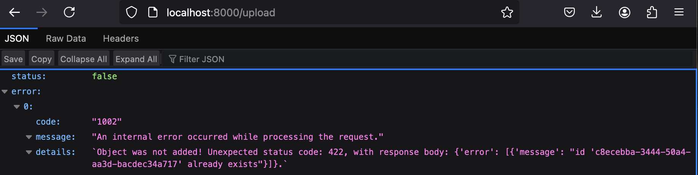

# quick fastapi package 
[fastapi specifications](https://pypi.org/project/fastapi/)
# weaviate embeded
[Weaviate Embeded Documentations](https://weaviate.io/developers/weaviate/installation/embedded) 

# install libararies
python3.12 -m venv .venv  
source .venv/bin/activate

pip install "fastapi[all]"
pip install sentence-transformers  #(sensence-transformer doesn't work with python3.13)
pip install llama-index-llms-openai
pip install llama-index-llms-replicate
pip install llama-index-embeddings-openai #(need openai key)
pip install llama-index-core llama-index-readers-file llama-index-llms-ollama 
pip install llama-index-embeddings-huggingface #(local embedding to save cost)

pip freeze > requirements.txt

# test api locally without image and docker
1. source .venv/bin/activate
2. uvicorn app.main:app --port 8001 (default port is 8000)
3. http://localhost:8000 
4. validate port and kill hanging process
ps aux | grep weaviate
lsof -i :8000 (show the process using the port, default port for embeded port=8079, grpc_port=50051)
kill -9 <pid>

# create Dockerfile locally 
docker build -t ragimage .
docker run -d -p 80:80 -p 8000:8000 --name rag_container ragimage
docker run -d -p 80:80 -p 8000:8000 -v $(pwd):/code your_image_name (to use local file in image:)

docker stop <container_id>
docker rm <container_id>
docker scout cves local://ragimage:latest (review vulnerability report )

# create docker remotely in Azure
docker login  <container_registry_server_name> -u  <container_user_name> -p <pwd> (login to docker )
docker build  --platform linux/amd64 -t ragcontainter.azurecr.io/<container_name>:<build-tag-Oct302024>  (docker build with build tag)
docker push ragcontainer.azurecr.io/ragapi:build-tag-oct302024
run app local: az deployment group operation list --resource-group rg-rag --name Microsoft.ContainerInstances-20241030221754
az deployment group operation list --resource-group rg-rag --name Microsoft.ContainerInstances-20241030221754

# weaviate embeded 
runs from (port=8079, grpc_port=50050)

# Return objects: API Specification has details
1. Note:  sample error object for upload 
   

# LlamaIndex
https://docs.llamaindex.ai/en/stable/understanding/querying/querying/
